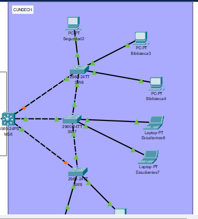
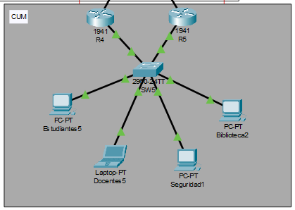
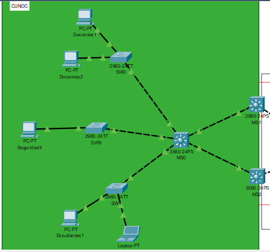
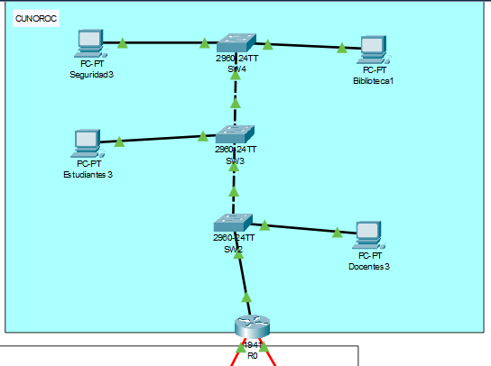
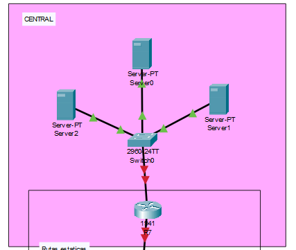

# 📌 Universidad de San Carlos de Guatemala  
### 🏛 Facultad de Ingeniería - Escuela de Ciencias y Sistemas  
### 🖥 Laboratorio Redes De Computadoras 1, Sección: N  

## 👤 Nombre: **Andrés Alejandro Agosto Méndez**  
## 🎓 Carnet: **202113580**  
## 👤 Nombre: **Edgar Josías Cán Ajquejay**  
## 🎓 Carnet: **202112012** 

## 🏥 **Proyecto 2**  

### TOPOLOGIA FINAL DEL PROYECTO


## 1. Resumen de Direcciones IP y VLAN

| Sede     | VLAN | Hosts requeridos | Subred               | Máscara           | Hosts útiles | Justificación |
|----------|------|------------------|----------------------|-------------------|--------------|---------------|
| CUNDECH  | 42   | 100              | 192.168.14.0/25      | 255.255.255.128   | 126          | Biblioteca necesita ~100; /25 provee 126 hosts útiles. |
| CUNDECH  | 12   | 50               | 192.168.14.128/26    | 255.255.255.192   | 62           | Estudiantes necesita 50; /26 provee 62 hosts útiles. |
| CUNDECH  | 22   | 20               | 192.168.14.192/27    | 255.255.255.224   | 30           | Docentes necesita 20; /27 provee 30 hosts útiles. |
| CUNDECH  | 32   | 5                | 192.168.14.224/29    | 255.255.255.248   | 6            | Seguridad necesita 5; /29 provee 6 hosts útiles. |
| CUNOROC  | 42   | 75               | 192.148.14.0/25      | 255.255.255.128   | 126          | Biblioteca necesita 75; /25 provee 126 hosts útiles. |
| CUNOROC  | 12   | 45               | 192.148.14.128/26    | 255.255.255.192   | 62           | Estudiantes necesita 45; /26 provee 62 hosts útiles. |
| CUNOROC  | 22   | 25               | 192.148.14.192/27    | 255.255.255.224   | 30           | Docentes necesita 25; /27 provee 30 hosts útiles. |
| CUNOROC  | 32   | 10               | 192.148.14.224/28    | 255.255.255.240   | 14           | Seguridad necesita 10; /28 provee 14 hosts útiles. |
| CUNOC    | 12   | 60               | 172.16.14.0/26       | 255.255.255.192   | 62           | Estudiantes necesita 60; /26 provee 62 hosts útiles. |
| CUNOC    | 42   | 50               | 172.16.14.64/26      | 255.255.255.192   | 62           | Biblioteca necesita 50; /26 provee 62 hosts útiles. |
| CUNOC    | 22   | 35               | 172.16.14.128/26     | 255.255.255.192   | 62           | Docentes necesita 35; /26 provee 62 hosts útiles. |
| CUNOC    | 32   | 5                | 172.16.14.192/29     | 255.255.255.248   | 6            | Seguridad necesita 5; /29 provee 6 hosts útiles. |
| CUM      | 42   | 75               | 192.158.14.0/25      | 255.255.255.128   | 126          | Biblioteca necesita 75; /25 provee 126 hosts útiles. |
| CUM      | 12   | 45               | 192.158.14.128/26    | 255.255.255.192   | 62           | Estudiantes necesita 45; /26 provee 62 hosts útiles. |
| CUM      | 22   | 25               | 192.158.14.192/27    | 255.255.255.224   | 30           | Docentes necesita 25; /27 provee 30 hosts útiles. |
| CUM      | 32   | 10               | 192.158.14.224/28    | 255.255.255.240   | 14           | Seguridad necesita 10; /28 provee 14 hosts útiles. |
| Central  | 52   | 60               | 192.122.14.128/26    | 255.255.255.192   | 62           | Server0 necesita 60; /26 provee 62 hosts útiles. |
| Central  | 62   | 35               | 192.122.14.192/27    | 255.255.255.224   | 30           | Server1 necesita 35; /27 provee 30 hosts útiles. |
| Central  | 72   | 5                | 192.122.14.224/28    | 255.255.255.240   | 14           | Server2 necesita 5; /28 provee 14 hosts útiles. |

---

# Configuración de la red CUNDECH



## 📋 CUNDECH – Tabla de Subredes


| Área         | VLAN | Subred            | Gateway IP      |
|--------------|------|-------------------|-----------------|
| Biblioteca   | 42   | 192.168.14.0/25   | 192.168.14.1    |
| Estudiantes  | 12   | 192.168.14.128/26 | 192.168.14.129  |
| Docentes     | 22   | 192.168.14.192/27 | 192.168.14.193  |
| Seguridad    | 32   | 192.168.14.224/29 | 192.168.14.225  |

---

## 🖥️ CONFIGURACION SWITCH SW7
```bash
enable
configure terminal

! Configuración VTP
vtp domain Grupo14
vtp password usac2025
vtp mode server

! Crear VLANs
vlan 12
 name Estudiantes
vlan 22
 name Docentes
vlan 32
 name Seguridad
vlan 42
 name Biblioteca

! Puertos de acceso
interface fa0/5
 switchport mode access
 switchport access vlan 12
 no shutdown

interface fa0/4
 switchport mode access
 switchport access vlan 12
 no shutdown

! Troncales
interface fa0/3
 switchport mode trunk
 switchport trunk allowed vlan 12,22,32,42
 no shutdown

interface fa0/2
 switchport mode trunk
 switchport trunk allowed vlan 12,22,32,42
 no shutdown

interface fa0/1
 switchport mode trunk
 switchport trunk allowed vlan 12,22,32,42
 no shutdown
```

## 🖥️ SWITCH SW8

```bash
enable
configure terminal

! Configuración VTP
vtp domain Grupo14
vtp password usac2025
vtp mode client

! Puertos de acceso
interface fa0/4
 switchport mode access
 switchport access vlan 22
 no shutdown

interface fa0/3
 switchport mode access
 switchport access vlan 22
 no shutdown

! Troncales
interface fa0/2
 switchport mode trunk
 switchport trunk allowed vlan 12,22,32,42
 no shutdown

interface fa0/1
 switchport mode trunk
 switchport trunk allowed vlan 12,22,32,42
 no shutdown
```

## 🖥️ SWITCH SW6

```bash
enable
configure terminal

! Configuración VTP
vtp domain Grupo14
vtp password usac2025
vtp mode client

! Puertos de acceso
interface fa0/5
 switchport mode access
 switchport access vlan 32
 no shutdown

interface fa0/4
 switchport mode access
 switchport access vlan 42
 no shutdown

interface fa0/3
 switchport mode access
 switchport access vlan 42
 no shutdown

! Troncales
interface fa0/2
 switchport mode trunk
 switchport trunk allowed vlan 12,22,32,42
 no shutdown

interface fa0/1
 switchport mode trunk
 switchport trunk allowed vlan 12,22,32,42
 no shutdown
```

## 🖥️ SWITCH MULTICAPA MS8

```bash
enable
configure terminal

! Habilitar ruteo
ip routing

! Configurar VLANs virtuales (puertas de enlace)
interface vlan 12
 ip address 192.168.14.129 255.255.255.192
 no shutdown

interface vlan 22
 ip address 192.168.14.193 255.255.255.224
 no shutdown

interface vlan 32
 ip address 192.168.14.225 255.255.255.248
 no shutdown

interface vlan 42
 ip address 192.168.14.1 255.255.255.128
 no shutdown

! Troncales hacia otros switches
interface fa0/2
 switchport mode trunk
 switchport trunk allowed vlan 12,22,32,42
 no shutdown

interface fa0/3
 switchport mode trunk
 switchport trunk allowed vlan 12,22,32,42
 no shutdown

interface fa0/4
 switchport mode trunk
 switchport trunk allowed vlan 12,22,32,42
 no shutdown

! VTP como cliente
vtp domain Grupo14
vtp password usac2025
vtp mode client
```

## 🖥️ PCs y direcciones IP 

| PC           | VLAN | IP               | Máscara             | Gateway           |
|--------------|------|------------------|----------------------|-------------------|
| Biblioteca3  | 42   | 192.168.14.2     | 255.255.255.128      | 192.168.14.1      |
| Biblioteca4  | 42   | 192.168.14.3     | 255.255.255.128      | 192.168.14.1      |
| Estudiantes6 | 12   | 192.168.14.130   | 255.255.255.192      | 192.168.14.129    |
| Estudiantes7 | 12   | 192.168.14.131   | 255.255.255.192      | 192.168.14.129    |
| Docentes6    | 22   | 192.168.14.194   | 255.255.255.224      | 192.168.14.193    |
| Docentes7    | 22   | 192.168.14.195   | 255.255.255.224      | 192.168.14.193    |
| Seguridad2   | 32   | 192.168.14.226   | 255.255.255.248      | 192.168.14.225    |

---

# Configuración de la red CUM



## 📋 CUM – Tabla de Subredes

| VLAN        | Hosts requeridos | Subred               | Máscara              | Gateway            |
|-------------|------------------|-----------------------|----------------------|--------------------|
| Biblioteca  | 75               | 192.158.14.0/25       | 255.255.255.128      | 192.158.14.1       |
| Estudiantes | 45               | 192.158.14.128/26     | 255.255.255.192      | 192.158.14.129     |
| Docentes    | 25               | 192.158.14.192/27     | 255.255.255.224      | 192.158.14.193     |
| Seguridad   | 10               | 192.158.14.224/28     | 255.255.255.240      | 192.158.14.225     |


## 🔧 Comandos de SW5
```bash
enable
configure terminal

vlan 12; name Estudiantes
vlan 22; name Docentes
vlan 32; name Seguridad
vlan 42; name Biblioteca

interface fa0/3; switchport mode access; switchport access vlan 12; no shutdown
interface fa0/4; switchport mode access; switchport access vlan 22; no shutdown
interface fa0/5; switchport mode access; switchport access vlan 32; no shutdown
interface fa0/6; switchport mode access; switchport access vlan 42; no shutdown

interface fa0/1-2
 switchport mode trunk
 switchport trunk allowed vlan 12,22,32,42
 no shutdown
```

## 🔧 Comandos en R4
```bash
enable
configure terminal
interface g0/1; no shutdown

interface g0/1.12
 encapsulation dot1Q 12
 ip address 192.158.14.130 255.255.255.192
 standby 12 ip 192.158.14.129
 standby 12 priority 110
 standby 12 preempt

interface g0/1.22
 encapsulation dot1Q 22
 ip address 192.158.14.194 255.255.255.224
 standby 22 ip 192.158.14.193
 standby 22 priority 110
 standby 22 preempt

interface g0/1.32
 encapsulation dot1Q 32
 ip address 192.158.14.226 255.255.255.240
 standby 32 ip 192.158.14.225
 standby 32 priority 110
 standby 32 preempt

interface g0/1.42
 encapsulation dot1Q 42
 ip address 192.158.14.2 255.255.255.128
 standby 42 ip 192.158.14.1
 standby 42 priority 110
 standby 42 preempt
```

## 🔧 Comandos en R5
```bash
enable
configure terminal
interface g0/1; no shutdown

interface g0/1.12
 encapsulation dot1Q 12
 ip address 192.158.14.131 255.255.255.192
 standby 12 ip 192.158.14.129
 standby 12 priority 100
 standby 12 preempt

interface g0/1.22
 encapsulation dot1Q 22
 ip address 192.158.14.195 255.255.255.224
 standby 22 ip 192.158.14.193
 standby 22 priority 100
 standby 22 preempt

interface g0/1.32
 encapsulation dot1Q 32
 ip address 192.158.14.227 255.255.255.240
 standby 32 ip 192.158.14.225
 standby 32 priority 100
 standby 32 preempt

interface g0/1.42
 encapsulation dot1Q 42
 ip address 192.158.14.3 255.255.255.128
 standby 42 ip 192.158.14.1
 standby 42 priority 100
 standby 42 preempt
```

## 🖥️ CUM – Asignación de IPs

| PC            | VLAN | IP                 | Máscara              | Gateway            |
|---------------|------|--------------------|----------------------|--------------------|
| Biblioteca2   | 42   | 192.158.14.4       | 255.255.255.128      | 192.158.14.1       |
| Estudiantes5  | 12   | 192.158.14.132     | 255.255.255.192      | 192.158.14.129     |
| Docentes5     | 22   | 192.158.14.196     | 255.255.255.224      | 192.158.14.193     |
| Seguridad1    | 32   | 192.158.14.228     | 255.255.255.240      | 192.158.14.225     |

---

# Configuración de la red CUNOC



## 📋 CUNOC – Tabla de Subredes

| VLAN        | Hosts requeridos | Subred             | Máscara              | Gateway           |
|-------------|------------------|--------------------|----------------------|-------------------|
| Estudiantes | 60               | 172.16.14.0/26     | 255.255.255.192      | 172.16.14.1       |
| Docentes    | 35               | 172.16.14.64/26    | 255.255.255.192      | 172.16.14.65      |
| Seguridad   | 5                | 172.16.14.128/27   | 255.255.255.224      | 172.16.14.129     |
| Biblioteca  | 50               | 172.16.14.160/28   | 255.255.255.240      | 172.16.14.161     |


## 🔧 COMANDOS PARA SW0, SW1, SW9

```bash
! SW0 (Docentes)
enable
configure terminal
vtp domain Grupo14
vtp password usac2025
vtp mode client
interface fa0/2-3
 switchport mode access
 switchport access vlan 22
interface fa0/1
 switchport trunk encapsulation dot1q
 switchport mode trunk
 switchport trunk allowed vlan 12,22,32,42

! SW1 (Estudiantes)
enable
configure terminal
vtp domain Grupo14
vtp password usac2025
vtp mode client
interface fa0/2-3
 switchport mode access
 switchport access vlan 12
interface fa0/1
 switchport trunk encapsulation dot1q
 switchport mode trunk
 switchport trunk allowed vlan 12,22,32,42

! SW9 (Seguridad)
enable
configure terminal
vtp domain Grupo14
vtp password usac2025
vtp mode client
interface fa0/2
 switchport mode access
 switchport access vlan 32
interface fa0/1
 switchport trunk encapsulation dot1q
 switchport mode trunk
 switchport trunk allowed vlan 12,22,32,42
```

## COMANDOS PARA 🔧 MS0

```bash
enable
configure terminal
vtp domain Grupo14
vtp password usac2025
vtp mode server
vlan 12
 name Estudiantes
vlan 22
 name Docentes
vlan 32
 name Seguridad
vlan 42
 name Biblioteca

interface fa0/4
 switchport trunk encapsulation dot1q
 switchport mode trunk
 switchport trunk allowed vlan 12,22,32,42
interface fa0/3
 switchport trunk encapsulation dot1q
 switchport mode trunk
 switchport trunk allowed vlan 12,22,32,42
interface fa0/5
 switchport trunk encapsulation dot1q
 switchport mode trunk
 switchport trunk allowed vlan 12,22,32,42
interface fa0/2
 switchport trunk encapsulation dot1q
 switchport mode trunk
 switchport trunk allowed vlan 12,22,32,42
interface fa0/1
 switchport trunk encapsulation dot1q
 switchport mode trunk
 switchport trunk allowed vlan 12,22,32,42
```

## COMANDOS PARA MS1/MS2 

```bash
! MS1 (Active)
enable
configure terminal
ip routing
vtp domain Grupo14
vtp password usac2025
vtp mode client
interface vlan 12
 ip address 172.16.14.2 255.255.255.192
 standby 12 ip 172.16.14.1
 standby 12 priority 110
 standby 12 preempt
 no shutdown
interface vlan 22
 ip address 172.16.14.66 255.255.255.192
 standby 22 ip 172.16.14.65
 standby 22 priority 110
 standby 22 preempt
 no shutdown
interface vlan 32
 ip address 172.16.14.130 255.255.255.224
 standby 32 ip 172.16.14.129
 standby 32 priority 110
 standby 32 preempt
 no shutdown
interface vlan 42
 ip address 172.16.14.162 255.255.255.240
 standby 42 ip 172.16.14.161
 standby 42 priority 110
 standby 42 preempt
 no shutdown

! MS2 (Standby)
enable
configure terminal
ip routing
vtp domain Grupo14
vtp password usac2025
vtp mode client
interface vlan 12
 ip address 172.16.14.3 255.255.255.192
 standby 12 ip 172.16.14.1
 standby 12 priority 100
 standby 12 preempt
 no shutdown
interface vlan 22
 ip address 172.16.14.67 255.255.255.192
 standby 22 ip 172.16.14.65
 standby 22 priority 100
 standby 22 preempt
 no shutdown
interface vlan 32
 ip address 172.16.14.131 255.255.255.224
 standby 32 ip 172.16.14.129
 standby 32 priority 100
 standby 32 preempt
 no shutdown
interface vlan 42
 ip address 172.16.14.163 255.255.255.240
 standby 42 ip 172.16.14.161
 standby 42 priority 100
 standby 42 preempt
 no shutdown
```

## 🖥️ CUNOC – Asignación de IPs

| PC            | VLAN | IP               | Máscara              | Gateway           |
|---------------|------|------------------|----------------------|-------------------|
| Estudiantes1  | 12   | 172.16.14.4      | 255.255.255.192      | 172.16.14.1       |
| Estudiantes2  | 12   | 172.16.14.5      | 255.255.255.192      | 172.16.14.1       |
| Docentes1     | 22   | 172.16.14.70     | 255.255.255.192      | 172.16.14.65      |
| Docentes2     | 22   | 172.16.14.71     | 255.255.255.192      | 172.16.14.65      |
| Seguridad4    | 32   | 172.16.14.132    | 255.255.255.224      | 172.16.14.129     |


# Configuración de la red CUNOROC



## 📋 CUNOROC – Tabla de Subredes

| VLAN        | Hosts requeridos | Subred             | Máscara              | Gateway           |
|-------------|------------------|--------------------|----------------------|-------------------|
| Estudiantes | 45               | 192.148.14.128/26     | 255.255.255.192      | 192.148.14.129       |
| Docentes    | 25               | 192.148.14.192/27    | 255.255.255.224     | 192.148.14.193      |
| Seguridad   | 10                | 192.148.14.224/28   | 255.255.255.240    | 192.148.14.225     |
| Biblioteca  | 75               | 192.148.14.0/25   | 255.255.255.128     | 192.148.14.1     |


## 🔧 COMANDOS PARA SW2, SW3, SW4

```bash
! SW2 (Docentes)
enable
configure terminal
vtp domain Grupo14
vtp password usac2025
vtp mode client 
interface fa0/3
 switchport mode access
 switchport access vlan 22
interface fa0/2
 switchport mode trunk

! SW3 (Estudiantes)
enable
configure terminal
vtp domain Grupo14
vtp password usac2025
vtp mode server

vlan 12
name Estudiantes
vlan 22
name Docentes
vlan 32
name Seguridad
vlan 42
name Biblioteca

interface fa0/3
 switchport mode access
 switchport access vlan 12
interface range fa0/1-2
 switchport mode trunk

! SW4 (Seguridad, Biblioteca)
enable
configure terminal
vtp domain Grupo14
vtp password usac2025
vtp mode client
interface fa0/2
 switchport mode access
 switchport access vlan 42
interface fa0/3
 switchport mode access
 switchport access vlan 32

interface fa0/1
 switchport mode trunk

```


## 🖥️ CUNOROC – Asignación de IPs

| PC            | VLAN | IP               | Máscara              | Gateway           |
|---------------|------|------------------|----------------------|-------------------|
| Seguridad3  | 32   |192.148.14.226      | 255.255.255.240      | 192.148.14.225      |
| Biblioteca1  | 42   | 192.148.14.2      | 255.255.255.128      | 192.148.14.1      |
| Estudiantes3     | 12   | 192.148.14.130     | 255.255.255.192      | 192.148.14.129    |
| Docentes3     | 22   | 192.148.14.194     | 255.255.255.224      | 192.148.14.193      |


# Configuración de la red CENTRAL




## 📋 Central – Asignación de IPs

| VLAN        | VLAN | subred             | Máscara              | 
|-------------|------------------|--------------------|----------------------|
| Server0 | 52               | 192.120.14.128/26     | 255.255.255.192      | 
| Server1    | 25               | 192.121.14.192/27    | 255.255.255.224     | 
| Server2   | 10                | 192.122.14.224/28   | 255.255.255.240    |


``` bash

! Switch0 (Server0,Server1,Server2)
vlan 52
 name Server0
vlan 62
 name Server1
vlan 72
 name Server2

! trunk hacia R7
interface fa0/1
switchport trunk encapsulation dot1q
switchport mode trunk
no shut

! configurar acceso
interface fa0/2
switchport mode access
switchport access vlan 72
spanning-tree portfast

interface fa0/4
switchport mode access
switchport access vlan 52
spanning-tree portfast

interface fa0/3
switchport mode access
switchport access vlan 62
spanning-tree portfast


! Configuración R7

interface g0/0 // !hacia MS5(backbone)
 ip address 10.0.0.6 255.255.255.252 // para dos dispositivos la ip 10.0.0.6/30
 no shut

// encender interfaz
interface g0/1
no shut

!--- Subinterface para Server0 (VLAN 52)
interface g0/1.52
encapsulation dot1Q 52
ip address 192.120.14.1 255.255.255.0
no shutdown

!--- Subinterface para Server1 (VLAN 62)
interface g0/1.62
encapsulation dot1Q 62
ip address 192.121.14.1 255.255.255.0
no shutdown

!--- Subinterface para Server2 (VLAN 72)
interface g0/1.72
encapsulation dot1Q 72
ip address 192.122.14.1 255.255.255.0
no shutdown

end


```

## 2. Subredes del Backbone

| Protocolo | Enlace                  | Subred           | Máscara             | Hosts requeridos | Hosts útiles | Justificación |
|-----------|-------------------------|------------------|----------------------|------------------|--------------|----------------|
| RIP       | MS3–R1                  | 10.10.10.8/30    | 255.255.255.252      | 2                | 2            | Enlace punto a punto. |
| RIP       | R1–R2                   | 10.10.10.12/30   | 255.255.255.252      | 2                | 2            | Enlace punto a punto. |
| RIP       | R1–R0                   | 10.10.10.16/30   | 255.255.255.252      | 2                | 2            | Enlace punto a punto. |
| BGP       | MS8–R10                 | 10.1.0.0/30      | 255.255.255.252      | 2                | 2            | Enlace punto a punto. |
| BGP       | R10–R9                  | 10.1.0.4/30      | 255.255.255.252      | 2                | 2            | Enlace punto a punto. |
| BGP       | R9–MS7                  | 10.1.0.8/30      | 255.255.255.252      | 2                | 2            | Enlace punto a punto. |
| OSPF      | R2–R3                   | 10.10.0.0/30     | 255.255.255.252      | 2                | 2            | Enlace punto a punto. |
| OSPF      | R3–MS4                  | 10.10.0.4/30     | 255.255.255.252      | 2                | 2            | Enlace punto a punto. |
| OSPF      | MS4–MS5 (Port-Channel1) | 10.10.0.8/30     | 255.255.255.252      | 2                | 2            | EtherChannel entre switches. |
| OSPF      | MS4–MS6 (Port-Channel2) | 10.10.0.12/30    | 255.255.255.252      | 2                | 2            | EtherChannel entre switches. |
| OSPF      | MS6–MS7 (Port-Channel3) | 10.10.0.16/30    | 255.255.255.252      | 2                | 2            | EtherChannel entre switches. |
| OSPF      | MS5–MS7 (Port-Channel4) | 10.10.0.20/30    | 255.255.255.252      | 2                | 2            | EtherChannel entre switches. |
| OSPF      | MS5–R7                  | 10.10.0.24/30    | 255.255.255.252      | 2                | 2            | Enlace punto a punto. |
| OSPF      | MS6–R4                  | 10.10.0.28/30    | 255.255.255.252      | 2                | 2            | Enlace punto a punto. |
| OSPF      | MS6–R5                  | 10.10.0.32/30    | 255.255.255.252      | 2                | 2            | Enlace punto a punto. |

# Configuración de RIP
``` bash
R1> enable
R1# configure terminal
R1(config)# interface GigabitEthernet0/0
R1(config-if)# ip address 10.10.10.10 255.255.255.252
R1(config-if)# no shutdown
R1(config-if)# exit
R1(config)# interface Serial0/0/0
R1(config-if)# ip address 10.10.10.13 255.255.255.252
R1(config-if)# clock rate 64000
R1(config-if)# no shutdown
R1(config-if)# exit
R1(config)# interface Serial0/0/1
R1(config-if)# ip address 10.10.10.17 255.255.255.252
R1(config-if)# clock rate 64000
R1(config-if)# no shutdown
R1(config-if)# exit
R1(config)# router rip
R1(config-router)# version 2
R1(config-router)# no auto-summary
R1(config-router)# network 10.10.10.8
R1(config-router)# network 10.10.10.12
R1(config-router)# network 10.10.10.16
R1(config-router)# exit


R0> enable
R0# configure terminal
R0(config)# interface Serial0/0/0
R0(config-if)# ip address 10.10.10.18 255.255.255.252
R0(config-if)# no shutdown
R0(config-if)# exit
R0(config)# interface Serial0/0/1
R0(config-if)# ip address 10.10.10.21 255.255.255.252
R0(config-if)# no shutdown
R0(config-if)# exit
R0(config)# interface GigabitEthernet0/0
R0(config-if)# ip address 192.148.14.1 255.255.255.128
R0(config-if)# no shutdown
R0(config-if)# exit
R0(config)# router rip
R0(config-router)# version 2
R0(config-router)# no auto-summary
R0(config-router)# network 10.10.10.16
R0(config-router)# network 10.10.10.20
R0(config-router)# network 192.148.14.0
R0(config-router)# exit

```

# Configuración de BGRP
``` bash
MS8> enable
MS8# configure terminal
MS8(config)# ip routing
MS8(config)# interface FastEthernet0/1
MS8(config-if)# no switchport
MS8(config-if)# ip address 10.1.0.1 255.255.255.252
MS8(config-if)# no shutdown
MS8(config-if)# exit
MS8(config)# router bgp 65008
MS8(config-router)# bgp log-neighbor-changes
MS8(config-router)# neighbor 10.1.0.2 remote-as 65010
MS8(config-router)# network 192.168.14.0 mask 255.255.255.128
MS8(config-router)# network 10.1.0.0 mask 255.255.255.252
MS8(config-router)# exit

R10> enable
R10# configure terminal
R10(config)# interface GigabitEthernet0/0
R10(config-if)# ip address 10.1.0.5 255.255.255.252
R10(config-if)# no shutdown
R10(config-if)# exit
R10(config)# interface GigabitEthernet0/1
R10(config-if)# ip address 10.1.0.2 255.255.255.252
R10(config-if)# no shutdown
R10(config-if)# exit
R10(config)# router bgp 65010
R10(config-router)# bgp log-neighbor-changes
R10(config-router)# neighbor 10.1.0.1 remote-as 65008
R10(config-router)# neighbor 10.1.0.6 remote-as 65009
R10(config-router)# network 10.1.0.0 mask 255.255.255.252
R10(config-router)# network 10.1.0.4 mask 255.255.255.252
R10(config-router)# exit

R9> enable
R9# configure terminal
R9(config)# interface GigabitEthernet0/0
R9(config-if)# ip address 10.1.0.9 255.255.255.252
R9(config-if)# no shutdown
R9(config-if)# exit
R9(config)# interface GigabitEthernet0/1
R9(config-if)# ip address 10.1.0.6 255.255.255.252
R9(config-if)# no shutdown
R9(config-if)# exit
R9(config)# router bgp 65009
R9(config-router)# bgp log-neighbor-changes
R9(config-router)# neighbor 10.1.0.5 remote-as 65010
R9(config-router)# neighbor 10.1.0.10 remote-as 65007
R9(config-router)# network 10.1.0.4 mask 255.255.255.252
R9(config-router)# network 10.1.0.8 mask 255.255.255.252
R9(config-router)# exit

MS7> enable
MS7# configure terminal
MS7(config)# ip routing
MS7(config)# interface FastEthernet0/1
MS7(config-if)# no switchport
MS7(config-if)# ip address 10.1.0.17 255.255.255.252
MS7(config-if)# no shutdown
MS7(config-if)# exit
MS7(config)# interface FastEthernet0/4
MS7(config-if)# no switchport
MS7(config-if)# ip address 10.1.0.21 255.255.255.252
MS7(config-if)# no shutdown
MS7(config-if)# exit
MS7(config)# router bgp 65007
MS7(config-router)# bgp log-neighbor-changes
MS7(config-router)# neighbor 10.1.0.9 remote-as 65009
MS7(config-router)# exit

```

# Configuración de OSPF

``` bash
R2> enable
R2# configure terminal
R2(config)# interface GigabitEthernet0/0
R2(config-if)# ip address 10.10.0.1 255.255.255.252
R2(config-if)# no shutdown
R2(config-if)# exit
R2(config)# router ospf 1
R2(config-router)# router-id 2.2.2.2
R2(config-router)# network 10.10.0.0 0.0.0.3 area 0
R2(config-router)# redistribute rip subnets
R2(config-router)# exit

R3> enable
R3# configure terminal
R3(config)# interface GigabitEthernet0/0
R3(config-if)# ip address 10.10.0.2 255.255.255.252
R3(config-if)# no shutdown
R3(config-if)# exit
R3(config)# interface GigabitEthernet0/1
R3(config-if)# ip address 10.10.0.5 255.255.255.252
R3(config-if)# no shutdown
R3(config-if)# exit
R3(config)# router ospf 1
R3(config-router)# router-id 3.3.3.3
R3(config-router)# network 10.10.0.0 0.0.0.3 area 0
R3(config-router)# network 10.10.0.4 0.0.0.3 area 0
R3(config-router)# exit

MS4> enable
MS4# configure terminal
MS4(config)# ip routing
MS4(config)# interface FastEthernet0/1
MS4(config-if)# no switchport
MS4(config-if)# ip address 10.10.0.6 255.255.255.252
MS4(config-if)# no shutdown
MS4(config-if)# exit
MS4(config)# interface range FastEthernet0/5 - 7
MS4(config-if-range)# channel-group 1 mode active
MS4(config-if-range)# exit
MS4(config)# interface Port-channel1
MS4(config-if)# no switchport
MS4(config-if)# ip address 10.10.0.9 255.255.255.252
MS4(config-if)# no shutdown
MS4(config-if)# exit
MS4(config)# interface range FastEthernet0/2 - 4
MS4(config-if-range)# channel-group 2 mode active
MS4(config-if-range)# exit
MS4(config)# interface Port-channel2
MS4(config-if)# no switchport
MS4(config-if)# ip address 10.10.0.13 255.255.255.252
MS4(config-if)# no shutdown
MS4(config-if)# exit
MS4(config)# router ospf 1
MS4(config-router)# router-id 4.4.4.4
MS4(config-router)# network 10.10.0.4 0.0.0.3 area 0
MS4(config-router)# network 10.10.0.8 0.0.0.3 area 0
MS4(config-router)# network 10.10.0.12 0.0.0.3 area 0
MS4(config-router)# exit

MS5> enable
MS5# configure terminal
MS5(config)# ip routing
MS5(config)# interface range FastEthernet0/1 - 3
MS5(config-if-range)# channel-group 1 mode active
MS5(config-if-range)# exit
MS5(config)# interface Port-channel1
MS5(config-if)# no switchport
MS5(config-if)# ip address 10.10.0.10 255.255.255.252
MS5(config-if)# no shutdown
MS5(config-if)# exit
MS5(config)# interface range FastEthernet0/4 - 6
MS5(config-if-range)# channel-group 4 mode active
MS5(config-if-range)# exit
MS5(config)# interface Port-channel4
MS5(config-if)# no switchport
MS5(config-if)# ip address 10.10.0.21 255.255.255.252
MS5(config-if)# no shutdown
MS5(config-if)# exit
MS5(config)# interface FastEthernet0/7
MS5(config-if)# no switchport
MS5(config-if)# ip address 10.10.0.25 255.255.255.252
MS5(config-if)# no shutdown
MS5(config-if)# exit
MS5(config)# ip route 192.120.14.0 255.255.255.0 10.10.0.26
MS5(config)# router ospf 1
MS5(config-router)# router-id 5.5.5.5
MS5(config-router)# network 10.10.0.8 0.0.0.3 area 0
MS5(config-router)# network 10.10.0.20 0.0.0.3 area 0
MS5(config-router)# network 10.10.0.24 0.0.0.3 area 0
MS5(config-router)# redistribute static subnets
MS5(config-router)# exit

MS6> enable
MS6# configure terminal
MS6(config)# ip routing
MS6(config)# interface range FastEthernet0/1 - 3
MS6(config-if-range)# channel-group 2 mode active
MS6(config-if-range)# exit
MS6(config)# interface Port-channel2
MS6(config-if)# no switchport
MS6(config-if)# ip address 10.10.0.14 255.255.255.252
MS6(config-if)# no shutdown
MS6(config-if)# exit
MS6(config)# interface range FastEthernet0/4 - 6
MS6(config-if-range)# channel-group 3 mode active
MS6(config-if-range)# exit
MS6(config)# interface Port-channel3
MS6(config-if)# no switchport
MS6(config-if)# ip address 10.10.0.17 255.255.255.252
MS6(config-if)# no shutdown
MS6(config-if)# exit
MS6(config)# interface FastEthernet0/7
MS6(config-if)# no switchport
MS6(config-if)# ip address 10.10.0.29 255.255.255.252
MS6(config-if)# no shutdown
MS6(config-if)# exit
MS6(config)# interface FastEthernet0/8
MS6(config-if)# no switchport
MS6(config-if)# ip address 10.10.0.33 255.255.255.252
MS6(config-if)# no shutdown
MS6(config-if)# exit
MS6(config)# router ospf 1
MS6(config-router)# router-id 6.6.6.6
MS6(config-router)# network 10.10.0.12 0.0.0.3 area 0
MS6(config-router)# network 10.10.0.16 0.0.0.3 area 0
MS6(config-router)# network 10.10.0.28 0.0.0.3 area 0
MS6(config-router)# network 10.10.0.32 0.0.0.3 area 0
MS6(config-router)# redistribute eigrp 100 subnets
MS6(config-router)# exit

MS7> enable
MS7# configure terminal
MS7(config)# ip routing
MS7(config)# interface range FastEthernet0/1 - 3
MS7(config-if-range)# channel-group 3 mode active
MS7(config-if-range)# exit
MS7(config)# interface Port-channel3
MS7(config-if)# no switchport
MS7(config-if)# ip address 10.10.0.18 255.255.255.252
MS7(config-if)# no shutdown
MS7(config-if)# exit
MS7(config)# interface range FastEthernet0/4 - 6
MS7(config-if-range)# channel-group 4 mode active
MS7(config-if-range)# exit
MS7(config)# interface Port-channel4
MS7(config-if)# no switchport
MS7(config-if)# ip address 10.10.0.22 255.255.255.252
MS7(config-if)# no shutdown
MS7(config-if)# exit
MS7(config)# router ospf 1
MS7(config-router)# router-id 7.7.7.7
MS7(config-router)# network 10.10.0.16 0.0.0.3 area 0
MS7(config-router)# network 10.10.0.20 0.0.0.3 area 0
MS7(config-router)# exit

R7> enable
R7# configure terminal
R7(config)# interface GigabitEthernet0/2
R7(config-if)# ip address 10.10.0.26 255.255.255.252
R7(config-if)# no shutdown
R7(config-if)# exit
R7(config)# router ospf 1
R7(config-router)# router-id 7.7.7.1
R7(config-router)# network 10.10.0.24 0.0.0.3 area 0
R7(config-router)# exit

R4> enable
R4# configure terminal
R4(config)# interface GigabitEthernet0/0
R4(config-if)# ip address 10.10.0.30 255.255.255.252
R4(config-if)# no shutdown
R4(config-if)# exit
R4(config)# router ospf 1
R4(config-router)# router-id 4.4.4.1
R4(config-router)# network 10.10.0.28 0.0.0.3 area 0
R4(config-router)# exit

R5> enable
R5# configure terminal
R5(config)# interface GigabitEthernet0/0
R5(config-if)# ip address 10.10.0.34 255.255.255.252
R5(config-if)# no shutdown
R5(config-if)# exit
R5(config)# router ospf 1
R5(config-router)# router-id 5.5.5.1
R5(config-router)# network 10.10.0.32 0.0.0.3 area 0
R5(config-router)# exit

```


