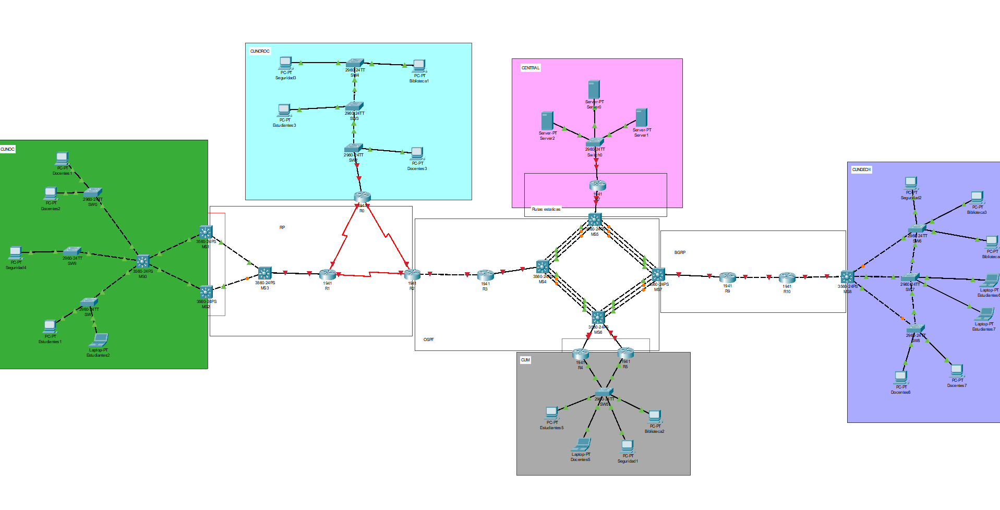

# 📌 Universidad de San Carlos de Guatemala  
### 🏛 Facultad de Ingeniería - Escuela de Ciencias y Sistemas  
### 🖥 Laboratorio Redes De Computadoras 1, Sección: N  

## 👤 Nombre: **Andrés Alejandro Agosto Méndez**  
## 🎓 Carnet: **202113580**  
## 👤 Nombre: **Edgar Josías Cán Ajquejay**  
## 🎓 Carnet: **202112012** 

## 🏥 **Proyecto 2**  

### TOPOLOGIA FINAL DEL PROYECTO


# Configuración de la red CUNDECH

## 📋 CUNDECH – Tabla de Subredes

| Área         | VLAN | Subred            | Gateway IP      |
|--------------|------|-------------------|-----------------|
| Biblioteca   | 42   | 192.168.14.0/25   | 192.168.14.1    |
| Estudiantes  | 12   | 192.168.14.128/26 | 192.168.14.129  |
| Docentes     | 22   | 192.168.14.192/27 | 192.168.14.193  |
| Seguridad    | 32   | 192.168.14.224/29 | 192.168.14.225  |

---

## 🖥️ CONFIGURACION SWITCH SW7
```bash
enable
configure terminal

! Configuración VTP
vtp domain Grupo14
vtp password usac2025
vtp mode server

! Crear VLANs
vlan 12
 name Estudiantes
vlan 22
 name Docentes
vlan 32
 name Seguridad
vlan 42
 name Biblioteca

! Puertos de acceso
interface fa0/5
 switchport mode access
 switchport access vlan 12
 no shutdown

interface fa0/4
 switchport mode access
 switchport access vlan 12
 no shutdown

! Troncales
interface fa0/3
 switchport mode trunk
 switchport trunk allowed vlan 12,22,32,42
 no shutdown

interface fa0/2
 switchport mode trunk
 switchport trunk allowed vlan 12,22,32,42
 no shutdown

interface fa0/1
 switchport mode trunk
 switchport trunk allowed vlan 12,22,32,42
 no shutdown
```

## 🖥️ SWITCH SW8

```bash
enable
configure terminal

! Configuración VTP
vtp domain Grupo14
vtp password usac2025
vtp mode client

! Puertos de acceso
interface fa0/4
 switchport mode access
 switchport access vlan 22
 no shutdown

interface fa0/3
 switchport mode access
 switchport access vlan 22
 no shutdown

! Troncales
interface fa0/2
 switchport mode trunk
 switchport trunk allowed vlan 12,22,32,42
 no shutdown

interface fa0/1
 switchport mode trunk
 switchport trunk allowed vlan 12,22,32,42
 no shutdown
```

## 🖥️ SWITCH SW6

```bash
enable
configure terminal

! Configuración VTP
vtp domain Grupo14
vtp password usac2025
vtp mode client

! Puertos de acceso
interface fa0/5
 switchport mode access
 switchport access vlan 32
 no shutdown

interface fa0/4
 switchport mode access
 switchport access vlan 42
 no shutdown

interface fa0/3
 switchport mode access
 switchport access vlan 42
 no shutdown

! Troncales
interface fa0/2
 switchport mode trunk
 switchport trunk allowed vlan 12,22,32,42
 no shutdown

interface fa0/1
 switchport mode trunk
 switchport trunk allowed vlan 12,22,32,42
 no shutdown
```

## 🖥️ SWITCH MULTICAPA MS8

```bash
enable
configure terminal

! Habilitar ruteo
ip routing

! Configurar VLANs virtuales (puertas de enlace)
interface vlan 12
 ip address 192.168.14.129 255.255.255.192
 no shutdown

interface vlan 22
 ip address 192.168.14.193 255.255.255.224
 no shutdown

interface vlan 32
 ip address 192.168.14.225 255.255.255.248
 no shutdown

interface vlan 42
 ip address 192.168.14.1 255.255.255.128
 no shutdown

! Troncales hacia otros switches
interface fa0/2
 switchport mode trunk
 switchport trunk allowed vlan 12,22,32,42
 no shutdown

interface fa0/3
 switchport mode trunk
 switchport trunk allowed vlan 12,22,32,42
 no shutdown

interface fa0/4
 switchport mode trunk
 switchport trunk allowed vlan 12,22,32,42
 no shutdown

! VTP como cliente
vtp domain Grupo14
vtp password usac2025
vtp mode client
```

## 🖥️ PCs y direcciones IP 

| PC           | VLAN | IP               | Máscara             | Gateway           |
|--------------|------|------------------|----------------------|-------------------|
| Biblioteca3  | 42   | 192.168.14.2     | 255.255.255.128      | 192.168.14.1      |
| Biblioteca4  | 42   | 192.168.14.3     | 255.255.255.128      | 192.168.14.1      |
| Estudiantes6 | 12   | 192.168.14.130   | 255.255.255.192      | 192.168.14.129    |
| Estudiantes7 | 12   | 192.168.14.131   | 255.255.255.192      | 192.168.14.129    |
| Docentes6    | 22   | 192.168.14.194   | 255.255.255.224      | 192.168.14.193    |
| Docentes7    | 22   | 192.168.14.195   | 255.255.255.224      | 192.168.14.193    |
| Seguridad2   | 32   | 192.168.14.226   | 255.255.255.248      | 192.168.14.225    |

---

## 📋 CUM – Tabla de Subredes

| VLAN        | Hosts requeridos | Subred               | Máscara              | Gateway            |
|-------------|------------------|-----------------------|----------------------|--------------------|
| Biblioteca  | 75               | 192.158.14.0/25       | 255.255.255.128      | 192.158.14.1       |
| Estudiantes | 45               | 192.158.14.128/26     | 255.255.255.192      | 192.158.14.129     |
| Docentes    | 25               | 192.158.14.192/27     | 255.255.255.224      | 192.158.14.193     |
| Seguridad   | 10               | 192.158.14.224/28     | 255.255.255.240      | 192.158.14.225     |


## 🔧 Comandos de SW5
```bash
enable
configure terminal

vlan 12; name Estudiantes
vlan 22; name Docentes
vlan 32; name Seguridad
vlan 42; name Biblioteca

interface fa0/3; switchport mode access; switchport access vlan 12; no shutdown
interface fa0/4; switchport mode access; switchport access vlan 22; no shutdown
interface fa0/5; switchport mode access; switchport access vlan 32; no shutdown
interface fa0/6; switchport mode access; switchport access vlan 42; no shutdown

interface fa0/1-2
 switchport mode trunk
 switchport trunk allowed vlan 12,22,32,42
 no shutdown
```

## 🔧 Comandos en R4
```bash
enable
configure terminal
interface g0/1; no shutdown

interface g0/1.12
 encapsulation dot1Q 12
 ip address 192.158.14.130 255.255.255.192
 standby 12 ip 192.158.14.129
 standby 12 priority 110
 standby 12 preempt

interface g0/1.22
 encapsulation dot1Q 22
 ip address 192.158.14.194 255.255.255.224
 standby 22 ip 192.158.14.193
 standby 22 priority 110
 standby 22 preempt

interface g0/1.32
 encapsulation dot1Q 32
 ip address 192.158.14.226 255.255.255.240
 standby 32 ip 192.158.14.225
 standby 32 priority 110
 standby 32 preempt

interface g0/1.42
 encapsulation dot1Q 42
 ip address 192.158.14.2 255.255.255.128
 standby 42 ip 192.158.14.1
 standby 42 priority 110
 standby 42 preempt
```

## 🔧 Comandos en R5
```bash
enable
configure terminal
interface g0/1; no shutdown

interface g0/1.12
 encapsulation dot1Q 12
 ip address 192.158.14.131 255.255.255.192
 standby 12 ip 192.158.14.129
 standby 12 priority 100
 standby 12 preempt

interface g0/1.22
 encapsulation dot1Q 22
 ip address 192.158.14.195 255.255.255.224
 standby 22 ip 192.158.14.193
 standby 22 priority 100
 standby 22 preempt

interface g0/1.32
 encapsulation dot1Q 32
 ip address 192.158.14.227 255.255.255.240
 standby 32 ip 192.158.14.225
 standby 32 priority 100
 standby 32 preempt

interface g0/1.42
 encapsulation dot1Q 42
 ip address 192.158.14.3 255.255.255.128
 standby 42 ip 192.158.14.1
 standby 42 priority 100
 standby 42 preempt
```

## 🖥️ CUM – Asignación de IPs

| PC            | VLAN | IP                 | Máscara              | Gateway            |
|---------------|------|--------------------|----------------------|--------------------|
| Biblioteca2   | 42   | 192.158.14.4       | 255.255.255.128      | 192.158.14.1       |
| Estudiantes5  | 12   | 192.158.14.132     | 255.255.255.192      | 192.158.14.129     |
| Docentes5     | 22   | 192.158.14.196     | 255.255.255.224      | 192.158.14.193     |
| Seguridad1    | 32   | 192.158.14.228     | 255.255.255.240      | 192.158.14.225     |

---

## 📋 CUNOC – Tabla de Subredes

| VLAN        | Hosts requeridos | Subred             | Máscara              | Gateway           |
|-------------|------------------|--------------------|----------------------|-------------------|
| Estudiantes | 60               | 172.16.14.0/26     | 255.255.255.192      | 172.16.14.1       |
| Docentes    | 35               | 172.16.14.64/26    | 255.255.255.192      | 172.16.14.65      |
| Seguridad   | 5                | 172.16.14.128/27   | 255.255.255.224      | 172.16.14.129     |
| Biblioteca  | 50               | 172.16.14.160/28   | 255.255.255.240      | 172.16.14.161     |


## 🔧 COMANDOS PARA SW0, SW1, SW9

```bash
! SW0 (Docentes)
enable
configure terminal
vtp domain Grupo14
vtp password usac2025
vtp mode client
interface fa0/2-3
 switchport mode access
 switchport access vlan 22
interface fa0/1
 switchport trunk encapsulation dot1q
 switchport mode trunk
 switchport trunk allowed vlan 12,22,32,42

! SW1 (Estudiantes)
enable
configure terminal
vtp domain Grupo14
vtp password usac2025
vtp mode client
interface fa0/2-3
 switchport mode access
 switchport access vlan 12
interface fa0/1
 switchport trunk encapsulation dot1q
 switchport mode trunk
 switchport trunk allowed vlan 12,22,32,42

! SW9 (Seguridad)
enable
configure terminal
vtp domain Grupo14
vtp password usac2025
vtp mode client
interface fa0/2
 switchport mode access
 switchport access vlan 32
interface fa0/1
 switchport trunk encapsulation dot1q
 switchport mode trunk
 switchport trunk allowed vlan 12,22,32,42
```

## COMANDOS PARA 🔧 MS0

```bash
enable
configure terminal
vtp domain Grupo14
vtp password usac2025
vtp mode server
vlan 12
 name Estudiantes
vlan 22
 name Docentes
vlan 32
 name Seguridad
vlan 42
 name Biblioteca

interface fa0/4
 switchport trunk encapsulation dot1q
 switchport mode trunk
 switchport trunk allowed vlan 12,22,32,42
interface fa0/3
 switchport trunk encapsulation dot1q
 switchport mode trunk
 switchport trunk allowed vlan 12,22,32,42
interface fa0/5
 switchport trunk encapsulation dot1q
 switchport mode trunk
 switchport trunk allowed vlan 12,22,32,42
interface fa0/2
 switchport trunk encapsulation dot1q
 switchport mode trunk
 switchport trunk allowed vlan 12,22,32,42
interface fa0/1
 switchport trunk encapsulation dot1q
 switchport mode trunk
 switchport trunk allowed vlan 12,22,32,42
```

## COMANDOS PARA MS1/MS2 

```bash
! MS1 (Active)
enable
configure terminal
ip routing
vtp domain Grupo14
vtp password usac2025
vtp mode client
interface vlan 12
 ip address 172.16.14.2 255.255.255.192
 standby 12 ip 172.16.14.1
 standby 12 priority 110
 standby 12 preempt
 no shutdown
interface vlan 22
 ip address 172.16.14.66 255.255.255.192
 standby 22 ip 172.16.14.65
 standby 22 priority 110
 standby 22 preempt
 no shutdown
interface vlan 32
 ip address 172.16.14.130 255.255.255.224
 standby 32 ip 172.16.14.129
 standby 32 priority 110
 standby 32 preempt
 no shutdown
interface vlan 42
 ip address 172.16.14.162 255.255.255.240
 standby 42 ip 172.16.14.161
 standby 42 priority 110
 standby 42 preempt
 no shutdown

! MS2 (Standby)
enable
configure terminal
ip routing
vtp domain Grupo14
vtp password usac2025
vtp mode client
interface vlan 12
 ip address 172.16.14.3 255.255.255.192
 standby 12 ip 172.16.14.1
 standby 12 priority 100
 standby 12 preempt
 no shutdown
interface vlan 22
 ip address 172.16.14.67 255.255.255.192
 standby 22 ip 172.16.14.65
 standby 22 priority 100
 standby 22 preempt
 no shutdown
interface vlan 32
 ip address 172.16.14.131 255.255.255.224
 standby 32 ip 172.16.14.129
 standby 32 priority 100
 standby 32 preempt
 no shutdown
interface vlan 42
 ip address 172.16.14.163 255.255.255.240
 standby 42 ip 172.16.14.161
 standby 42 priority 100
 standby 42 preempt
 no shutdown
```

## 🖥️ CUNOC – Asignación de IPs

| PC            | VLAN | IP               | Máscara              | Gateway           |
|---------------|------|------------------|----------------------|-------------------|
| Estudiantes1  | 12   | 172.16.14.4      | 255.255.255.192      | 172.16.14.1       |
| Estudiantes2  | 12   | 172.16.14.5      | 255.255.255.192      | 172.16.14.1       |
| Docentes1     | 22   | 172.16.14.70     | 255.255.255.192      | 172.16.14.65      |
| Docentes2     | 22   | 172.16.14.71     | 255.255.255.192      | 172.16.14.65      |
| Seguridad4    | 32   | 172.16.14.132    | 255.255.255.224      | 172.16.14.129     |


